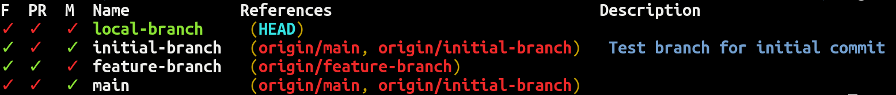

# Bash wrapper for 'git' command

Features:
- `git branch` -> List branches with their status, description, references and relation to main branch.
  
- `git cd` -> Alias for `git root` from `git-extras` for jumping into repository root directory.
- `git comment` -> Add comment via editor to current branch, read by `git branch`.
- `git mark <tag>` -> Add tag to current branch description. `git branch` supports tags `pr` and `finished`.
- `git unmark <tag>` -> Removes tag from current branch description.
- `git finish` -> Adds `finished` tag to current branch.
- `git unfinish` -> Removes `finished` tag from current branch.
- `git pr codespell` -> Runs [codespell][codespell] against diff and log from the main branch.

Additional information are stored in `.git/config`, which means they will be removed if you delete and clone your repository again.

Dependencies:
- `util-linux` -> For `column` command for nice, aligned formatting.
- `git-extras` -> For `git root` command.

To try it out, run the commands below:
```sh
git clone https://github.com/invidian/git-bash-wrapper.git
cd git-bash-wrapper
source ./git.sh
git branch
```

[codespell]: https://github.com/codespell-project/codespell
